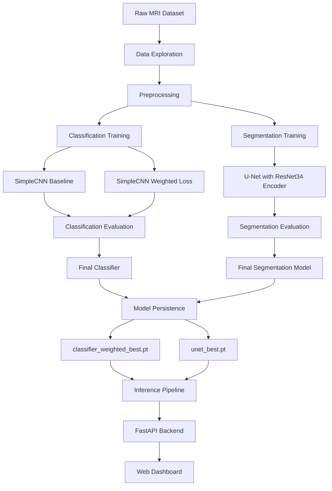
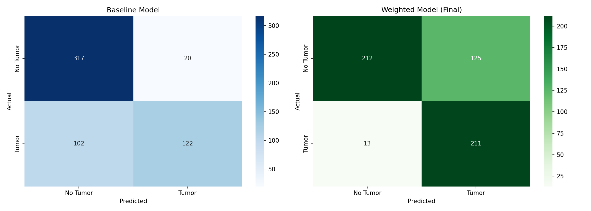
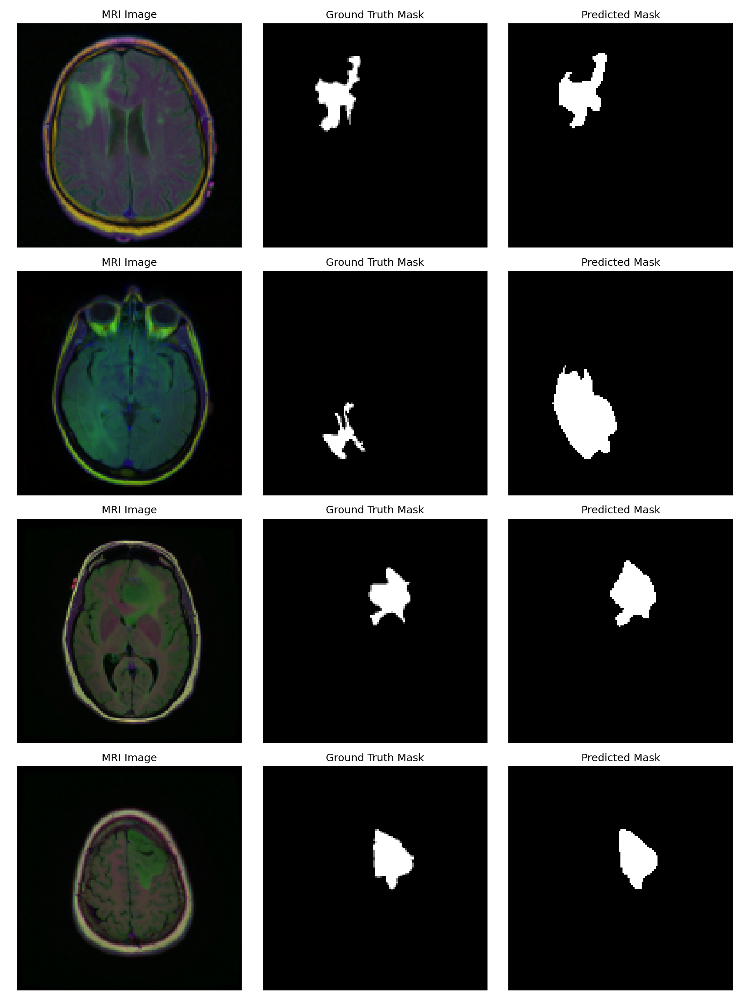

# Brain Tumor Detection & Segmentation


End-to-end Deep Learning project for detecting brain tumors in MRI scans and segmenting the affected region at the pixel level.

> Built for portfolio and educational purposes only. Not a medical device — must not be used for real clinical diagnosis or treatment decisions.

## Overview

Manually reviewing MRI scans for tumors is time-consuming and requires specialist expertise.

This project focuses on building a two-stage deep learning pipeline that first screens an MRI scan for tumor presence, then segments the exact tumor region when one is found.

The complete workflow includes:

- Exploratory Data Analysis (EDA)
- Data Preprocessing
- Classification Model Training
- Class Imbalance Handling
- Segmentation Model Training
- Model Persistence
- Unified Inference Pipeline
- Web Dashboard and REST API


## Machine Learning Pipeline




## Dataset

This project uses the LGG MRI Segmentation Dataset, a publicly available dataset of brain MRI scans with manually annotated tumor masks.

The dataset contains 3,929 MRI slices from 110 patients, including:

- FLAIR sequence MRI images
- Pixel-level tumor segmentation masks

Source: [Kaggle – LGG MRI Segmentation Dataset](https://www.kaggle.com/datasets/mateuszbuda/lgg-mri-segmentation)

Citation: Buda, M., Saha, A., Mazurowski, M.A. "Association of genomic subtypes of lower-grade gliomas with shape features automatically extracted by a deep learning algorithm." Computers in Biology and Medicine, 2019.

License: CC BY-NC-SA 4.0

### Target

The classification target is:

Tumor Present

Binary classification:

- 0 → No tumor
- 1 → Tumor present

For tumor-positive slices, the segmentation target is a binary pixel mask of the tumor region.


## Class Imbalance Handling

The dataset is imbalanced — approximately 65% of slices contain no tumor. A baseline classifier trained on this data missed nearly half of all real tumors.

To fix this, the model was retrained with a class-weighted BCEWithLogitsLoss (pos_weight), which penalizes missed tumors more heavily — the right trade-off for a medical screening tool, where a missed tumor is far costlier than a false alarm.


## Machine Learning Models

### Classification models trained and evaluated:

| Model | Accuracy | F1 Score |
|------|----------|----------|
| SimpleCNN Baseline | 78.3% | 0.667 |
| SimpleCNN Weighted Loss | 75.4% | 0.754 |

### Segmentation model:

| Model | Dice Score | IoU |
|------|-----------|-----|
| U-Net with ResNet34 Encoder | 0.879 | 0.842 |


## Final Model

The selected final models:

Classifier: SimpleCNN with weighted loss
Segmentation: U-Net with ResNet34 encoder (ImageNet pretrained)

Final performance:

| Metric | Score |
|------|------|
| Accuracy | 75.4% |
| Precision | 62.8% |
| Recall | 94.2% |
| F1 Score | 0.754 |


## Results

### Classification: Baseline vs. Weighted Loss



### Segmentation Predictions




## Project Structure

```text
brain-tumor-detection-segmentation/
│
├── config/
│   └── config.yaml
│
├── data/
│   └── raw/
│       └── kaggle_3m/
│
├── models/
│   ├── classification/
│   │   └── weights/
│   └── segmentation/
│       └── weights/
│
├── notebooks/
│   ├── 01_data_exploration.ipynb
│   ├── 02_classification_baseline.ipynb
│   ├── 03_segmentation_unet.ipynb
│   └── 04_pipeline_test.ipynb
│
├── src/
│   ├── data/
│   │   ├── preprocessing.py
│   │   ├── dataset.py
│   │   └── segmentation_dataset.py
│   ├── models/
│   │   ├── classifier.py
│   │   └── unet.py
│   └── inference/
│       └── predict.py
│
├── web/
│   ├── index.html
│   └── assets/
│
├── outputs/
│   └── figures/
│       ├── classification_confusion_matrices.png
│       └── segmentation_predictions_sample.png
│
├── tests/
│
├── .gitignore
├── LICENSE
├── README.md
├── requirements.txt
└── server.py
```


## Installation

Clone the repository:

```bash
git clone https://github.com/amirha-jafari/brain-tumor-detection-segmentation.git
```

Navigate to the project directory:

```bash
cd brain-tumor-detection-segmentation
```

Create a virtual environment:

```bash
python -m venv venv
```

Activate the virtual environment:

Windows

```bash
venv\Scripts\activate
```

Linux / macOS

```bash
source venv/bin/activate
```

Install the required dependencies:

```bash
pip install -r requirements.txt
```

Download the [LGG MRI Segmentation Dataset](https://www.kaggle.com/datasets/mateuszbuda/lgg-mri-segmentation) and place it under `data/raw/kaggle_3m/` (only needed if retraining the models).


## Usage

Run the backend API:

```bash
uvicorn server:app --reload
```

The API runs at `http://127.0.0.1:8000` (interactive docs at `/docs`).

Then open `web/index.html` in a browser. The dashboard performs the complete prediction pipeline automatically:

- Accepts an uploaded MRI scan
- Runs the classification model
- If a tumor is detected, runs the segmentation model
- Overlays the predicted tumor mask on the original MRI
- Displays the diagnosis, confidence score, and clinical notes

### Example Output

```text
Prediction: Patient has tumor
Confidence: 92%
Segmentation Dice Score: 0.879
```


## Technologies Used

- Python
- PyTorch
- torchvision
- segmentation-models-pytorch
- OpenCV
- Pandas
- NumPy
- Scikit-learn
- FastAPI
- Uvicorn
- Pillow
- HTML / CSS / JavaScript
- Jupyter Notebook
- Git & GitHub


## Future Improvements

Possible future enhancements include:

- Add Grad-CAM visualization for classifier explainability
- Support multi-class tumor type classification
- Add authentication and per-user analysis history
- Containerize the application using Docker
- Deploy the API to a cloud platform
- Add automated tests for the inference pipeline


## License

MIT — see `LICENSE`. The dataset itself is licensed separately under CC BY-NC-SA 4.0 (see Dataset section above).
